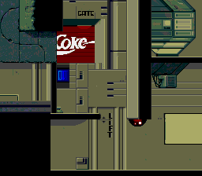

# fb_dump_genesis.py

Tool to extract and convert data files from [Flashback: The Quest for Identity](https://www.mobygames.com/game/flashback-the-quest-for-identity) Sega Genesis ROMs.

Supported ROM versions: Europe, Japan, USA and [Sep 1992 Prototype](https://hiddenpalace.org/Flashback_(Sep_18,_1992_prototype)).

## Usage

```
$ python3 fb_dump_genesis.py romfile.md --output_dir /tmp
```

## Screenshots



